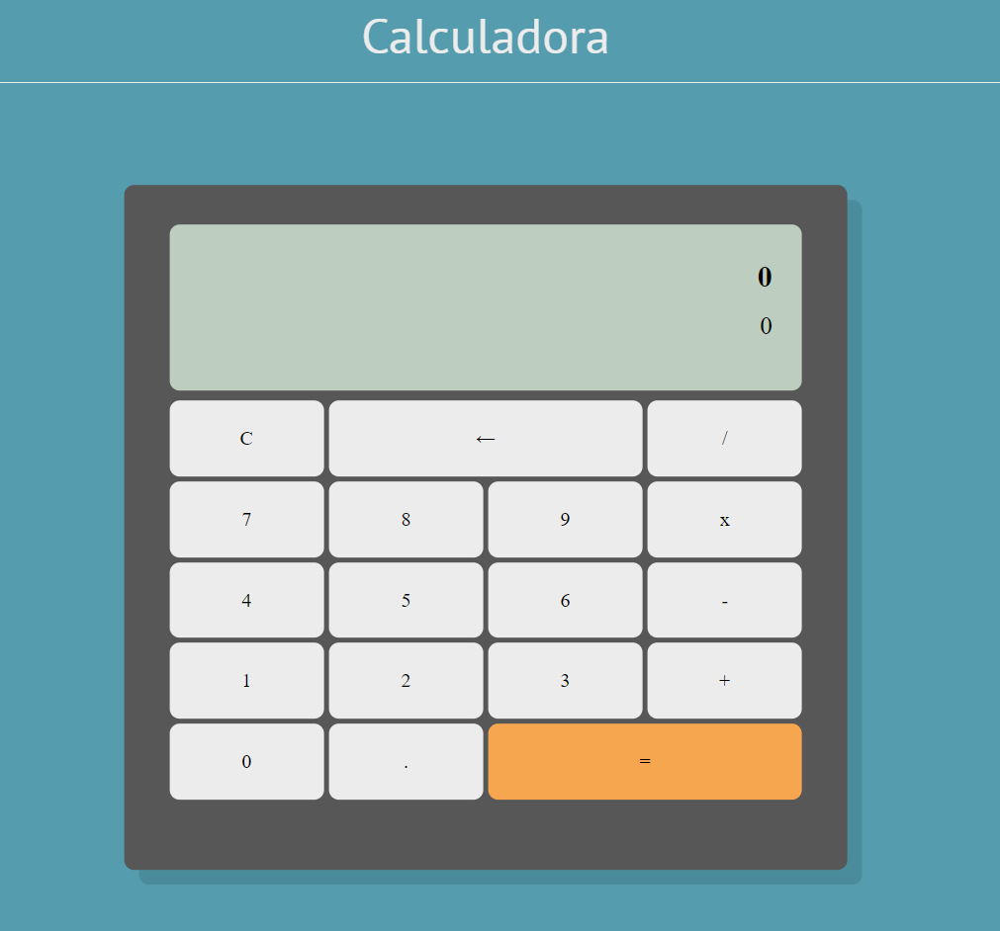

#  Calculadora Ingenieria Web

## Descripción
Este es el primer proyecto de la materia ingenieria web. 
Es una calculadora web que permite realizar operaciones matemáticas básicas como suma, resta, multiplicación y división. La calculadora ha sido desarrollada utilizando tecnologías web fundamentales: HTML para la estructura, CSS para el diseño y JavaScript para la funcionalidad.



## Caracteristicas
#### Interfaz de Usuario (UI):
- Botones para los dígitos del 0 al 9.
- Operaciones básicas: suma, resta, multiplicación y división.
- Botón para limpiar la entrada o reiniciar la calculadora.
- Diseño claro y estéticamente agradable.
- Responsividad para funcionar correctamente en diferentes tamaños de pantalla.

#### Funcionalidad:
- Realiza operaciones matemáticas básicas y muestra el resultado en pantalla.
- Permite encadenar varias operaciones.
- Manejo de errores, como la división por cero.

## Estructutra del proyecto 
El proyecto está organizado de la siguiente manera:

- **index.html:** Archivo principal que contiene la estructura básica de la calculadora y el contenido estatico.
- **CSS:** Carpeta que contiene los archivo normalize.css y styles.css. En el styles.css se encuentran todos los estilos de la calculadora 
- **JS:** Carpeta que contiene los archivos JavaScript que manejan la lógica de la calculadora.

## Como ejecutar el proyecto 
1. Debes clonar el repositorio en tu maquina local
   ```bash
   git clone https://github.com/JuanPablo-A/calculadora_ingeweb.git
   ```

3. Abre el archivo index.html en tu navegador, puedes utilizar la extension de *HTML play* o *Live Server* para hacerlo
